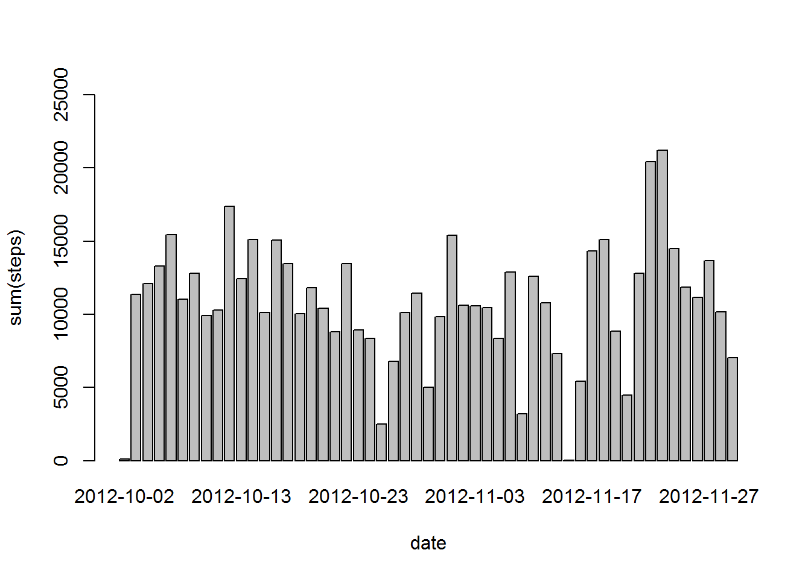

# Reproducible Research: Peer Assessment 1

##Loading and preprocessing the data

Load input data from a zip file from the current R working directory.
```{r}
# Clear the workspace
rm(list=ls())
if (!file.exists("activity.csv")) {
  unzip("activity.zip")
}
activity <- read.csv("activity.csv", colClass=c('integer', 'Date', 'integer'))
```

##What is mean total number of steps taken per day?
- The total number of steps taken per day

```{r}
steps.date <- aggregate(steps ~ date, activity, sum)
head(steps.date)
```

- Histogram of the total number of steps taken each day

```{r}
barplot(steps.date$steps, names.arg=steps.date$date, ylim=c(0, 25000),xlab="date",ylab="sum(steps)")

```
 


- Mean of total number of steps taken per day

```{r}
mean(steps.date$steps)
```

- Median of total number of steps taken per day

```{r}
median(steps.date$steps)
```

## What is the average daily activity pattern?

- Time series plot of the 5-minute interval and average number of steps taken averaged across all days

```{r}
steps.interval <- aggregate(steps ~ interval, activity, mean)
plot(steps.interval, type='l')
```

- The 5-minute interval contains the maximum number of steps

```{r}
steps.interval$interval[which.max(steps.interval$steps)]
```

##Imputing missing values

- The total number of missing values in the dataset(i.e. the total number of rows with NAs)

```{r}
sum(is.na(activity$steps))
```

- Devise a strategy for filling in all of the missing values in the dataset. The strategy does not need to be sophisticated. For example, you could use the mean/median for that day, or the mean for that 5-minute interval, etc
```{r}
activity.clean <- merge(activity, steps.date, by="date", suffixes=c("", ".mean"))
nas <- is.na(activity.clean$steps)
activity.clean$steps[nas] <- activity.clean$steps.mean[nas]
activity.clean <- activity.clean[, c(1:3)]
head(activity.clean)
```

- Histogram of the total number of steps taken each day

```{r}
steps.date <- aggregate(steps ~ date, activity.clean, sum)
hist(steps.date$steps,main=" ",breaks=10,xlab="After Imputate NA-Total Number of Steps Taken Daily")
```

- Mean of total number of steps taken per day

```{r}
mean(steps.date$steps)
```

- Median of total number of steps taken per day

```{r}
median(steps.date$steps)
```

###Observations:

- Data don't appear to be significant different because imputation uses mean for that particular day but steps are NA for that entire day.

##Are there differences in activity patterns between weekdays and weekends?
- Create a new factor variable in the dataset with two levels - "weekdays" and "weekend" indicating whether a given date is a weekday or weekend day.

```{r}
dayType <- function(dates) {
  f <- function(date) {
    if (weekdays(date) %in% c("Saturday", "Sunday")) {
      "weekend"
    }
    else {
      "weekday"
    }
  }
  sapply(dates, f)
}

activity$dayType <- as.factor(dayType(activity$date))
str(activity)
```
- Make a panel plot containing a time series plot (i.e. type = "l") of the 5-minute interval (x-axis) and the average number of steps taken, averaged across all weekday days or weekend days (y-axis).
```{r}
library(lattice)

steps.interval <- aggregate(steps ~ interval + dayType, activity, mean)
xyplot(steps ~ interval | dayType, data=steps.interval, layout=c(1,2), type='l', 
       xlab=" Interval",
       ylab="Number of Steps Taken")
```
